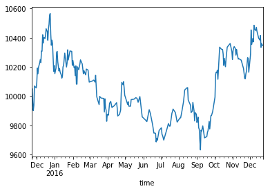

```python
%pylab inline
import matplotlib.pyplot as plt
import pandas as pd
import numpy as np
import os
import sys
```

    Populating the interactive namespace from numpy and matplotlib
    

###  申赎模拟V1.0


```python
# 5档用户模拟，一共1000个用户
c_list = np.random.choice(5, 1000, p=[0.1, 0.2, 0.3, 0.3, 0.1])

# 时间序列400天
t_list = pd.period_range('2015-11-20', periods=400, freq='D')

# 时序分布概率，控制时间间隔和时间抽样的概率
tp = np.array([1/60 * 2/8] * 60 + [1/120 * 2/8] * 120 + [1/100 * 1/8] * 100 + [1/120 * 3/8] * 120)
# 随机时间序列400天
rt = np.random.choice(t_list, 400, p=tp)
```


```python
# 申赎明细模拟函数
def br_sample(n):
    # 选择时间
    ts = np.random.choice(rt, n)
    amount_list = np.zeros(n)
    
    # 申赎的次数
    buy = np.int(n * 0.6)
    redeem = n - buy
    
    # 赎回的份额为负值
    red_inx = np.random.choice(range(n), redeem, replace=False)
    buy_inx = set(range(n)) - set(red_inx)

    for i in red_inx:
        amount = np.round(np.random.normal(loc=-11,scale=1,size=1))
        if amount > 0:
            amount = -1 * amount
        amount_list[i] = amount
    for i in buy_inx:  
        amount = np.round(np.random.normal(loc=10,scale=6,size=1))
        if amount < 0:
            amount = -1 * amount
        amount_list[i] = amount
    return ts, amount_list
```


```python
# 不同频次用户对应的申赎总次数
c_to_f = {4:10, 3:8, 2:6, 1:4, 0: 2}
df = pd.DataFrame()
# 模拟
res = []
for u in c_list:
    ts, amounts = br_sample(c_to_f[u])
    for t,a in zip(ts, amounts):
        df = pd.concat([df,pd.DataFrame({'time':[t], 'user':[u], 'amount':[a]})])
```

## 某基金持有份额随时间变化


```python
df2 = df.groupby('time').sum()
df2['cumsum'] = df2['amount'].cumsum() + 10000  # 加上初始持有份额
df2['cumsum'].plot()
```


    <matplotlib.axes._subplots.AxesSubplot at 0x23a9a3f4c50>





```python
df2.head()
```


<div>
<style>
    .dataframe thead tr:only-child th {
        text-align: right;
    }

    .dataframe thead th {
        text-align: left;
    }

    .dataframe tbody tr th {
        vertical-align: top;
    }
</style>
<table border="1" class="dataframe">
  <thead>
    <tr style="text-align: right;">
      <th></th>
      <th>amount</th>
      <th>user</th>
      <th>cumsum</th>
    </tr>
    <tr>
      <th>time</th>
      <th></th>
      <th></th>
      <th></th>
    </tr>
  </thead>
  <tbody>
    <tr>
      <th>2015-11-22</th>
      <td>46.0</td>
      <td>126</td>
      <td>10046.0</td>
    </tr>
    <tr>
      <th>2015-11-23</th>
      <td>6.0</td>
      <td>16</td>
      <td>10052.0</td>
    </tr>
    <tr>
      <th>2015-11-24</th>
      <td>-80.0</td>
      <td>64</td>
      <td>9972.0</td>
    </tr>
    <tr>
      <th>2015-11-25</th>
      <td>130.0</td>
      <td>83</td>
      <td>10102.0</td>
    </tr>
    <tr>
      <th>2015-11-26</th>
      <td>-57.0</td>
      <td>112</td>
      <td>10045.0</td>
    </tr>
  </tbody>
</table>
</div>


```python
# df2.head(10)
```


```python
list_date = pd.date_range('2015-1-1', '2017-10-29', freq='D')
len(list_date)
```


    1033


